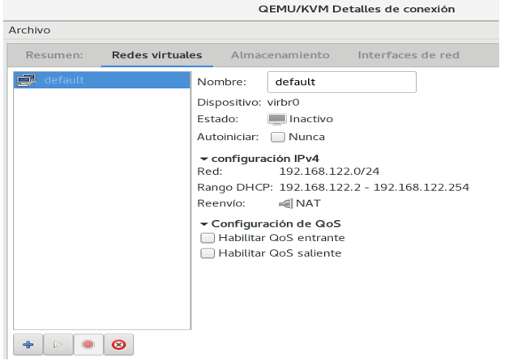

# RedKVM
Configuracion de redes en KVM - Tutorial Avanzado
<p align="center">
    
</p>
En este tutorial vamos a ver como configurar una red en KVM de manera avanzada, para ello vamos a utilizar una maquina debian12 virtualiza sobre virtual box y KVM instalado.

Si quieres saber como instalar KVM en tu maquina puedes ver el siguiente repositorio : [Instalacion de KVM](https://github.com/AdrianCE94/Instalacion-KVM)


## Redes que podemos configurar en KVM

- **Redes Virtuales (Privadas)** : tienen bridge interno que lo llamaremos `vmbrX`  

- **Redes Puente(Públicas)** : bridge externo que lo llamaremos `brX` 


Recordar que un bridge/swich es un dispositivo de interconexion de redes.Libvirt se basa en el concepto de switch virtual utilizado por Linux-Bridge.

## Red por defecto en KVM instalado  por Qemu-KVM

- **virbr0** : Red NAT que se crea por defecto al instalar KVM, más conocida como la red default

Esto se puede comprobar en el virt-manager donde veremos que el servidor DHCP esta activo(gracias al paquere dnsmasq-base).

para mas información puedes consultar el fichero:
 `/usr/share/doc/qemu-kvm/README.Debian`

 

 La red default por defecto no esta iniciada.Para mostrar las redes activas e inactivas puedes utilizar el comando:

```bash
virsh net-list --all
```

Para iniciar la red default del hipervisor puedes utilizar el comando:

```bash
virsh net-start default
 ```

Es recomendable activar la propiedad de inicio automatico de la red default:

```bash
virsh net-autostart default
```

Usando la red default podemos crear otras redes:

copiamos o volcamos el fichero asociado xml de la red default:
iremos a `/etc/libvirt/qemu/networks` y veremos el fichero `default.xml` que es el fichero de configuración de la red default.
para copiarlo podemos utilizar el comando:
```bash
virsh net-dumpxml default > mired2.xml
```
---

Ahora tenemos que editar el fichero xml que hemos copiado --> `mired2.xml`

```bash
nano mired2.xml
```

Tendremos que generar:

- **Nuevo UUID** : `uuidgen`
- **MAC Address** : `printf 'DE:AD:BE:EF:%02X:%02X\n' $((RANDOM%256)) $((RANDOM%256))`
- **Cambiar el nombre virbr**

lo mandamos al archivo xml de mired2.xml
y definimos la red

```bash
virsh net-define mired2.xml
virsh net-start mired2
virsh net-autostart mired2
```
**NOTA**: Recuerda que cuando un usuario crea una red privada la configuración de la red se guarda en el directorio `/etc/libvirt/qemu/networks`.


## Definición de redes Virtuales Aisladas
Igual a la de tipo NAT, pero quitaremos la etiqueta `<forward mode='nat'/>`.Copiamos el fichero `default.xml` y lo renombramos a `isolated.xml` y lo editamos.
```bash
virsh net-define /etc/libvirt/qemu/networks/isolated.xml
```

## Comandos de ayuda útiles
```bash
net-autostart <nombre_red> # Activar inicio automatico
net-create <nombre_red> # Crear red
net-define <nombre_red> # Definir red
net-destroy <nombre_red> # Detener red
net-dhcp-leases <nombre_red> # Mostrar leases DHCP
net-dumpxml <nombre_red> # Mostrar configuración de red
net-edit <nombre_red> # Editar configuración de red
net-info <nombre_red> # Mostrar información de red
```

## Configuración de Redes Puente

Para configurar una red puente necesitamos un bridge en el host, para ello necesitamos instalar el paquete `bridge-utils`:

```bash
sudo apt-get install bridge-utils
```

Para crear un bridge en el host, editamos el fichero `/etc/network/interfaces` y añadimos:

```bash
auto br0
iface br0 inet static
    address
    netmask
    gateway
    bridge_ports
    bridge_stp off
    bridge_fd 0
    bridge_maxwait 0
```

Reiniciamos el servicio de red:

```bash
sudo systemctl restart networking
```

Para crear un dhcp puenteando, editamos el fichero `/etc/network/interfaces` y añadimos:

```bash
auto br0
iface br0 inet dhcp
    bridge_ports
    bridge_stp off
    bridge_fd 0
    bridge_maxwait 0
```

